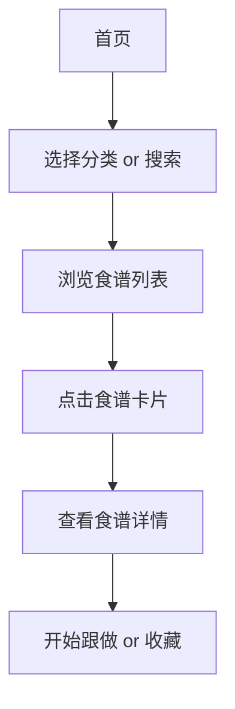
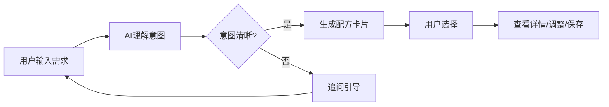

# 烘焙AI宝典 - 产品需求文档 (Demo版)

## 1. 产品概述

烘焙AI宝典是一款面向烘焙爱好者的智能食谱助手，通过AI技术帮助用户定制个性化烘焙方案。

**核心价值**：降低烘焙门槛，让每个人都能轻松完成从"想做什么"到"成功成品"的转化。

**目标用户**：烘焙初学者、家庭烘焙爱好者、想要尝试新食谱的用户

---

## 2. 核心功能模块

### 2.1 功能清单 (Demo范围)

| 页面 | 模块 | 功能描述 |
|------|------|----------|
| 首页 | Hero区域 | 品牌展示 + 热门推荐 |
| 首页 | 分类导航 | 蛋糕/面包/饼干/甜点/饮品 五大品类 |
| 首页 | 热门食谱 | 卡片式展示，点击进入详情 |
| 分类页 | 品类筛选 | 按品类筛选食谱列表 |
| 搜索页 | 关键词搜索 | 支持食谱名称、食材搜索 |
| 食谱详情 | 基础信息 | 成品图、难度、时长、评分 |
| 食谱详情 | 食材清单 | 份量缩放（0.5x~4x） |
| 食谱详情 | 步骤教程 | 分步骤图文卡片 |
| AI助手 | 对话生成 | 输入需求，AI生成配方 |
| 个人中心 | 收藏夹 | 收藏的食谱列表 |

### 2.2 用户角色

| 角色 | 注册方式 | 核心权限 |
|------|----------|----------|
| 访客 | 无需注册 | 浏览、搜索、查看食谱 |
| 用户 | 手机号/微信 | AI生成(每日3次)、收藏、跟做引导 |

---

## 3. 核心流程

### 3.1 用户浏览流程

### 3.2 AI配方生成流程

---

## 4. 界面设计规范

### 4.1 设计风格

- **主题色调**：温暖的烘焙色系
  - 主色：`#D4956A`（焦糖棕）
  - 辅助色：`#C45D3E`（红陶土）
  - 背景色：`#FFF8F3`（奶油白）
  - 强调色：`#2D2016`（深可可）
- **字体**：Noto Sans SC（中文）+ Playfair Display（英文标题）
- **圆角**：12px（卡片）、8px（按钮）、20px（大容器）
- **阴影**：柔和阴影 `0 4px 20px rgba(45, 32, 22, 0.08)`

### 4.2 布局规范

- 桌面端：最大宽度1200px，12列网格
- 卡片间距：24px
- 内容区内边距：48px（桌面）/ 16px（移动端）

### 4.3 动效规范

- 页面切换：淡入淡出 300ms ease-out
- 卡片悬停：上浮8px + 阴影增强
- 按钮点击：缩放0.96 + 颜色加深
- 加载状态：骨架屏动画

---

## 5. 页面详细设计

### 5.1 首页 (Home)

| 模块 | UI元素 | 交互行为 |
|------|--------|----------|
| 顶部导航 | Logo、搜索图标、用户头像 | 点击Logo回首页，点击搜索进入搜索页 |
| Hero区域 | 大Banner图 + 引导文案 | 自动轮播5秒/张 |
| 分类导航 | 5个圆形图标 + 文字 | 点击进入分类页 |
| 热门食谱 | 3列卡片网格 | 悬停上浮，点击进入详情 |

### 5.2 食谱详情页 (Recipe Detail)

| 模块 | UI元素 | 交互行为 |
|------|--------|----------|
| 成品图 | 顶部大图(16:9) | - |
| 信息栏 | 名称/难度/时长/评分 | - |
| 份量选择器 | 滑动条 0.5x~4x | 拖动实时换算食材用量 |
| 食材清单 | 可折叠列表 | 点击展开/收起 |
| 步骤教程 | 图文卡片列表 | 点击"开始跟做"进入引导模式 |
| 底部操作栏 | 收藏/分享/开始跟做 | 固定在底部 |

### 5.3 AI助手页 (AI Chat)

| 模块 | UI元素 | 交互行为 |
|------|--------|----------|
| 对话区域 | 消息列表 | AI回复带"[AI生成]"标识 |
| 输入区域 | 文本输入框 + 发送按钮 | 回车发送 |
| 快捷入口 | "我有这些食材"/"换个口味" | 一键发送预设问题 |

---

## 6. 技术约束

- **响应式**：桌面优先，移动端适配
- **性能**：首屏加载 < 3秒
- **兼容性**：Chrome/Firefox/Safari/Edge 最新两版本
- **无障碍**：基础ARIA标签支持

---

## 7. 数据说明

Demo版本使用静态JSON数据模拟后端接口，包含：
- 20+ 精选食谱
- 5 大品类分类
- 模拟AI回复话术

---

*文档版本：v1.0 Demo*
*创建日期：2026-06-27*
