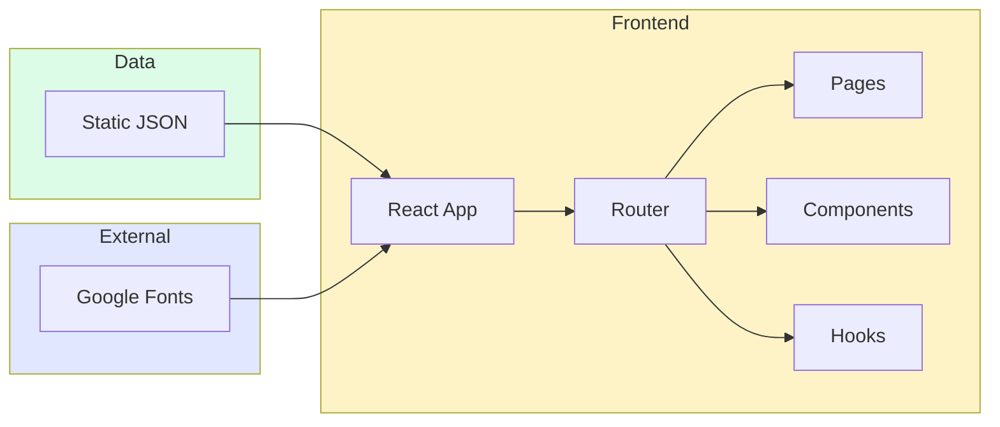

# 烘焙AI宝典 - 技术架构文档 (Demo版)

## 1. 架构设计



**说明**：Demo版本为纯前端单页应用，使用静态JSON数据模拟后端接口。

---

## 2. 技术选型

| 类别 | 技术 | 版本 |
|------|------|------|
| 框架 | React | 18.x |
| 构建工具 | Vite | 5.x |
| 样式 | Tailwind CSS | 3.x |
| 路由 | React Router DOM | 6.x |
| 图标 | Lucide React | 最新 |
| 动画 | Framer Motion | 11.x |

---

## 3. 路由定义

| 路径 | 页面组件 | 功能 |
|------|----------|------|
| `/` | HomePage | 首页：Hero、分类、热门食谱 |
| `/category/:type` | CategoryPage | 分类页：按品类筛选 |
| `/search` | SearchPage | 搜索页：关键词搜索 |
| `/recipe/:id` | RecipeDetailPage | 食谱详情页 |
| `/ai-chat` | AIChatPage | AI助手对话页 |
| `/profile` | ProfilePage | 个人中心 |
| `/favorites` | FavoritesPage | 我的收藏 |

---

## 4. 组件结构

```
src/
├── components/
│   ├── layout/
│   │   ├── Header.jsx        # 顶部导航
│   │   ├── Footer.jsx        # 底部信息
│   │   └── Layout.jsx        # 页面容器
│   ├── home/
│   │   ├── Hero.jsx          # Hero轮播
│   │   ├── CategoryNav.jsx   # 分类导航
│   │   └── RecipeCard.jsx    # 食谱卡片
│   ├── recipe/
│   │   ├── RecipeDetail.jsx  # 食谱详情
│   │   ├── IngredientList.jsx # 食材清单
│   │   ├── StepList.jsx      # 步骤列表
│   │   └── ServingScaler.jsx # 份量缩放
│   ├── ai/
│   │   ├── ChatMessage.jsx   # 聊天消息
│   │   └── ChatInput.jsx     # 输入框
│   └── ui/
│       ├── Button.jsx
│       ├── Card.jsx
│       ├── Badge.jsx
│       └── Loading.jsx
├── pages/
│   ├── HomePage.jsx
│   ├── CategoryPage.jsx
│   ├── SearchPage.jsx
│   ├── RecipeDetailPage.jsx
│   ├── AIChatPage.jsx
│   ├── ProfilePage.jsx
│   └── FavoritesPage.jsx
├── data/
│   └── recipes.json          # 静态食谱数据
├── hooks/
│   └── useRecipes.js         # 数据获取Hook
├── styles/
│   └── index.css             # 全局样式 + Tailwind
├── App.jsx
└── main.jsx
```

---

## 5. 数据模型

### 5.1 食谱数据结构

```typescript
interface Recipe {
  id: string;
  name: string;
  category: 'cake' | 'bread' | 'cookie' | 'dessert' | 'drink';
  difficulty: 'easy' | 'medium' | 'hard';
  time: number;          // 分钟
  rating: number;        // 1-5
  image: string;         // 图片URL
  description: string;
  ingredients: Ingredient[];
  steps: Step[];
  tips: string[];
}

interface Ingredient {
  name: string;
  amount: number;        // 基准份量
  unit: string;          // g/ml/个等
}

interface Step {
  order: number;
  title: string;
  description: string;
  duration?: number;     // 可选，计时时长（秒）
  image?: string;
}
```

### 5.2 用户数据结构 (Demo仅本地存储)

```typescript
interface User {
  id: string;
  name: string;
  avatar?: string;
  favorites: string[];  // 收藏的食谱ID数组
}
```

---

## 6. 状态管理

- **React Context**：用于用户状态（收藏夹）和主题
- **LocalStorage**：持久化用户收藏数据
- **组件级State**：UI交互状态

---

## 7. API模拟 (Demo)

AI对话功能使用预设话术模拟：

```javascript
// 模拟AI回复逻辑
const aiResponses = {
  '我想做蛋糕': '为你推荐几款经典蛋糕配方...',
  '我有面粉鸡蛋牛奶': '可以用这些食材做：戚风蛋糕、松软小餐包...',
  'default': '请告诉我你想做什么类型的烘焙？蛋糕、面包还是饼干？'
};
```

---

## 8. 性能优化

- 图片懒加载
- 组件代码分割（React.lazy）
- Tailwind CSS purge
- 资源预加载

---

*文档版本：v1.0 Demo*
*创建日期：2026-06-27*
